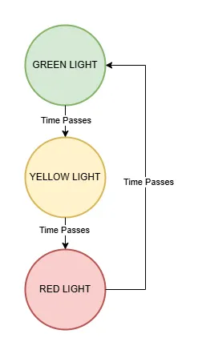
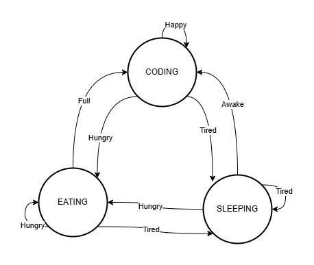
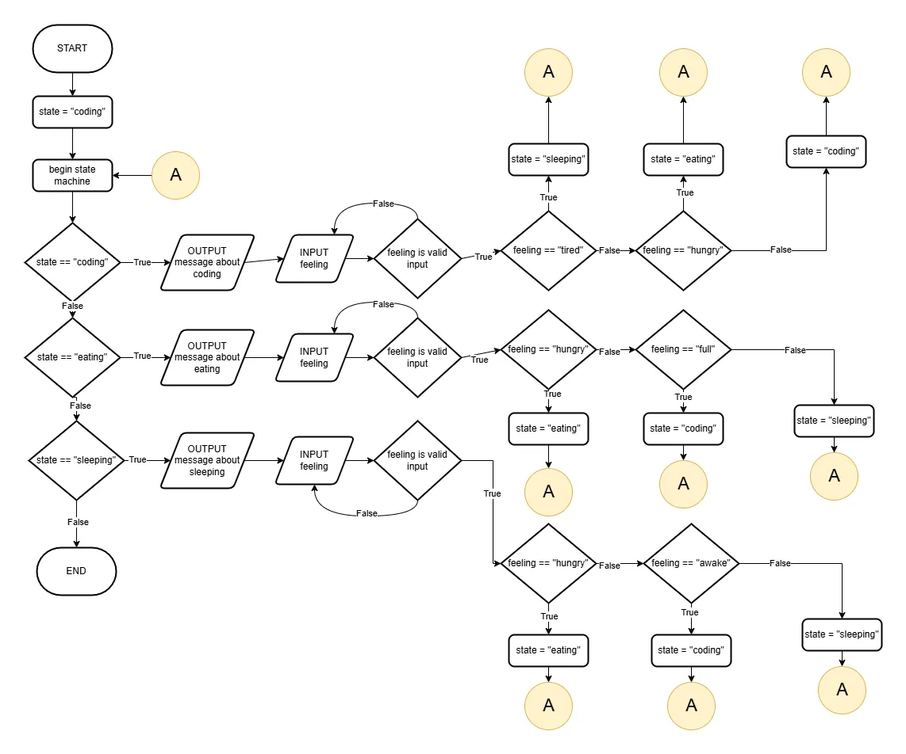

# Activity 6: State Machines

In this activity, we will walk through how to create a simple state machine using Python.

Once you have completed the activity, be sure to also complete the [Extension Activity](#extension-activity-create-your-own-state-machine)!

## Overview of State Machines

| State Machine                                                                                  |
|:-----------------------------------------------------------------------------------------------|
| *A system that changes its behavior by moving between different states in response to events.* |

### What is a State Machine?

A state machine is a way of organizing a program by dividing it into different states. A state represents what the program is currently doing or how it is currently behaving.

At any given time, a state machine can only be in one state. When an event occurs, the program may transition from its current state to a different state. The actions available to the program often depend on which state it is currently in.

For example, a traffic light might have the states **Green**, **Yellow**, and **Red**. After a certain amount of time, the light transitions from one state to the next. The behavior of the traffic light changes depending on its current state.

State machines are commonly used in games, user interfaces, robots, and other interactive systems because they make it easier to manage complex behavior by breaking it into simple, organized states.

### Parts of a State Machine

A state machine is made up of several connected parts that work together to control behavior. The most important parts are states, which represent different modes of operation, events, which trigger changes, and transitions, which define how the system moves between states. By combining these parts, a state machine can respond to different situations in a clear and organized way.

#### State

| State                                                   |
|:--------------------------------------------------------|
| *Represents the current condition or mode of a system.* |

It determines how the system behaves and what actions it can perform. At any given time, a state machine is typically in only one state.

#### Event

| Event (State Machine)                                |
|:-----------------------------------------------------|
| *Something that happens while a program is running.* |

Events can come from user input, sensors, timers, or other parts of a program. Events are often used to determine when a state machine should change states.

#### Transition

| Transition (State Machine)                         |
|:---------------------------------------------------|
| *The process of moving from one state to another.* |

Transitions occur when specific events happen and any required conditions have been met. Transitions define how a state machine changes its behavior over time.

### How This State Machine Works

This state machine models the behavior of a traffic light. It contains three **states**: **Green Light**, **Yellow Light**, and **Red Light**. The system can only be in one of these states at a time.



The **event** that causes the state machine to change states is **Time Passes**. Whenever this event occurs, the traffic light follows a specific **transition** to the next state.

When the light is in the **Green Light** state and time passes, it transitions to **Yellow Light**. When the light is in the **Yellow Light** state and time passes, it transitions to **Red Light**. When the light is in the **Red Light** state and time passes, it transitions back to **Green Light**.

Notice that transitions only occur along the arrows shown in the diagram. This means **Green Light cannot transition directly to Red Light**, **Yellow Light cannot transition directly to Green Light**, and **Red Light cannot transition directly to Yellow Light**. The traffic light must always follow the sequence **Green → Yellow → Red → Green**. This is one of the key advantages of a state machine: it clearly defines which state changes are allowed and which are not.

## 1. Create a Root Folder

Whenever you are creating a new Python project, it is best to stay organized by placing all the files related to the project in the same folder. If you are in the GitHub classroom, you will already have a folder created. If not, create a folder for Activity 6.

Inside the folder, create a new `main.py` file.

## 2. States, Events, and Transitions in a Program

So far, our diagram has given us a conceptual overview of what a state machine is but hasn't practically outlined how it applies to a program.

In a program, the state is always stored as a variable, for our traffic light example, our state might start like this:

```python
state = "green"
```

The program then defines behavior depending on the value of the current state:

```python
if state == "green":
    print("GREEN LIGHT")
elif state == "yellow":
    print("YELLOW LIGHT")
elif state == "red":
    print("RED LIGHT")
```

For a state machine to work properly, it needs to continuously be checking the state, so typically we will put it in a loop. This continuously repeats the behaviour of the current state:

```python
while True:
    if state == "green":
        print("GREEN LIGHT")
    elif state == "yellow":
        print("YELLOW LIGHT")
    elif state == "red":
        print("RED LIGHT")
```

With every iteration of the loop, we can also define transitions, so that the program can change from one state to the next. With our simple state machine diagram for our traffic light, we can define our transitions like this:

```python
while True:
    if state == "green":
        print("GREEN LIGHT")
        state = "yellow"
    elif state == "yellow":
        print("YELLOW LIGHT")
        state = "red"
    elif state == "red":
        print("RED LIGHT")
        state = "green"
```

Our diagram also defines a very simple event, waiting a short period of time. In Python, we can add this by importing the time library, and telling our program to `sleep` for a specified amount of time in seconds:

```python
import time

state = "green"

while True:
    if state == "green":
        print("GREEN LIGHT")
        time.sleep(5)
        state = "yellow"
    elif state == "yellow":
        print("YELLOW LIGHT")
        time.sleep(1)
        state = "red"
    elif state == "red":
        time.sleep(5)
        print("RED LIGHT")
        state = "green"
```

With that, you have just created your first ever state machine!

However, this state machine is a little boring, and doesn't allow for any kind of user input. Let's look at and create an example of a state machine that incorporates:

* User input
* Multiple transitions from a state

## 3. A More Complicated State Machine

Let's assume you are a computer science student who loves programming so much, that you only ever do 3 things:

* Eat
* Sleep
* Code

We can create a state machine that tracks which of these states you should transition to, based on how you are feeling:



With this we have the following transitions:

|Initial State|Event|End State|
|:--:|:--:|:--:|
|CODING|Tired|SLEEPING|
|CODING|Hungry|EATING|
|CODING|Happy|CODING|
|EATING|Full|CODING|
|EATING|Hungry|EATING|
|EATING|Tired|SLEEPING|
|SLEEPING|Tired|SLEEPING|
|SLEEPING|Awake|CODING|
|SLEEPING|Hungry|EATING|

We can actually take our state machine, and reformat it as a flowchart!



## 4. State Machine Pseudocode

If we wanted to structure the above state machine as pseudocode, it could be shown as this:

```txt
START PROGRAM
state = "coding"
WHILE True:
    IF state == "coding" THEN:
        OUTPUT "You are coding!"
        WHILE True:
            OUTPUT "How are you feeling?"
            INPUT feeling
            IF feeling is valid THEN:
                IF feeling == "tired" THEN:
                    state = "sleeping"
                ELSE IF feeling == "hungry" THEN:
                    state = "eating"
                ELSE:
                    state = "coding"
                END IF
                BREAK
            END IF
        END WHILE
    ELSE IF state == "eating" THEN:
        OUTPUT "You are eating!"
        WHILE True:
            OUTPUT "How are you feeling?"
            INPUT feeling
            IF feeling is valid THEN:
                IF feeling == "hungry" THEN:
                    state = "eating"
                ELSE IF feeling == "full" THEN:
                    state = "coding"
                ELSE:
                    state = "sleeping"
                END IF
                BREAK
            END IF
        END WHILE
    ELSE IF state == "sleeping" THEN:
        OUTPUT "You are sleeping!"
        WHILE True:
            OUTPUT "How are you feeling?"
            INPUT feeling
            IF feeling is valid THEN:
                IF feeling == "hungry" THEN:
                    state = "eating"
                ELSE IF feeling == "awake" THEN:
                    state = "coding"
                ELSE:
                    state = "sleeping"
                END IF
                BREAK
            END IF
        END WHILE
    END IF
END WHILE
END PROGRAM
```

## 5. Implement the Program

With some pseudocode and a flowchart, it's time to build the program in Python! Using Python syntax, construct the above state machine!

## Extension Activity: Create Your Own State Machine

Create your own interactive state machine that responds to user input and changes between different states.

### Requirements

* Create a state machine with exactly **4 different states**.
* Each state must display a different message that clearly shows the program's current state.
* Each state must allow the user to choose from at least **2 valid events** that cause the program to transition to another state.
* Store the current state in a variable and use a loop with `if` / `elif` statements to control the state machine.
* Validate the user's input so that invalid events do not change the current state.
